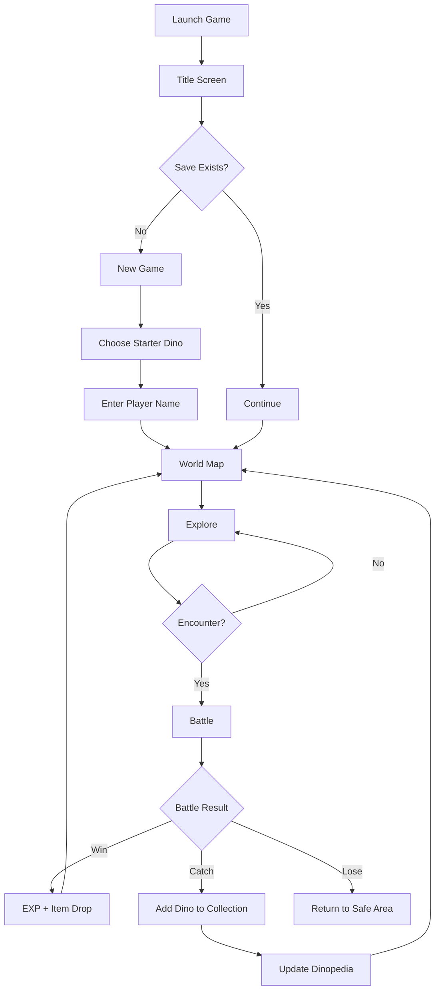
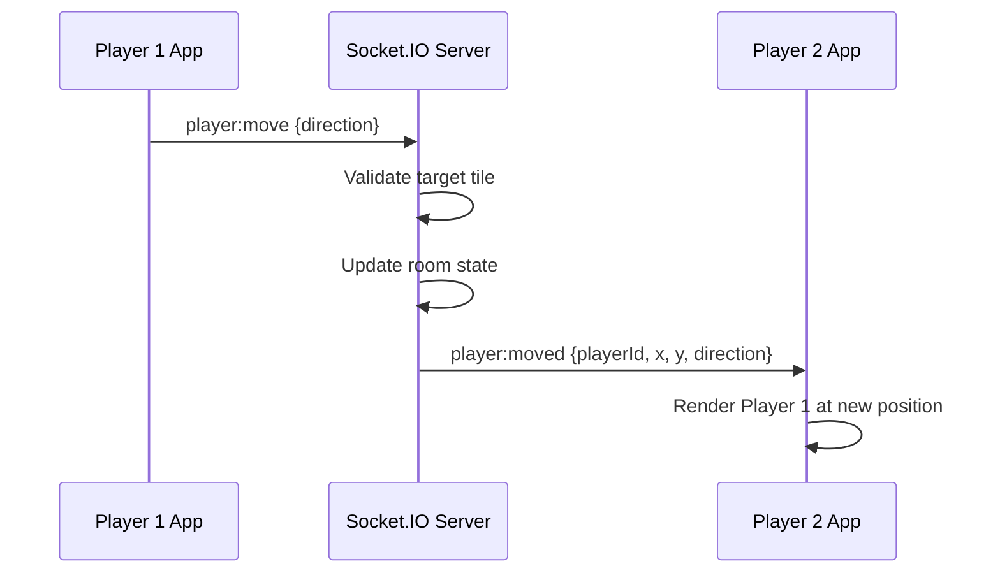

# Planetaurus — Game Development Design

**Version:** 1.0  
**Platform target:** Android first, iOS later  
**Recommended MVP stack:** React Native + TypeScript  
**Multiplayer stack:** Node.js + Socket.IO/WebSocket  
**Game genre:** Dinosaur monster-catching RPG  
**Visual MVP style:** 2D pixel-art world map + 2D battle sprites  
**Future visual target:** 3D realistic battle scene using Blender/Unity pipeline

---

## 1. Game Vision

Planetaurus is a dinosaur-catching RPG where the player chooses a starter dinosaur, explores a world map, battles wild dinosaurs, catches them with Dino Balls, trains them, plays with them, rides them, discovers them in the Dinopedia, creates custom dinosaurs using gene blueprints, and plays together with another player through multiplayer rooms.

### Core fantasy

> “I choose my starter dinosaur, explore the world with my kid/sibling, catch dinosaurs, train them, ride them, and battle together.”

### Game pillars

| Pillar | Description |
|---|---|
| Catch | Find wild dinosaurs and catch them using Dino Balls. |
| Battle | Turn-based battle with HP, SP, Attack, Defend, and Special Move. |
| Train | Improve dinosaur stats through training activities. |
| Bond | Play with dinosaurs to increase bond/friendship. |
| Ride | Ride eligible dinosaurs based on size, bond, and condition. |
| Discover | Fill Dinopedia with caught dinosaurs; uncaught remain silhouettes. |
| Create | Use Dino Gene Blueprint and gene items to create custom dinosaurs. |
| Multiplayer | Players can join rooms, see movement in real time, and agree to PvP battles. |

---

## 2. MVP Scope

### Included in MVP

- Choose 1 of 3 starter dinosaurs.
- 2D tile-based world map.
- Terrain and collision system.
- Wild dinosaur encounter system.
- Turn-based battle.
- HP and SP system.
- Battle actions: Attack, Defend, Special Move, Dino Ball, Run.
- Every dinosaur has its own unique special move.
- Dino Ball catching system.
- Dinopedia with silhouette for uncaught dinosaurs.
- Local save.
- Training system.
- Play/interact with dinosaur system.
- Ride system for eligible dinosaurs.
- Inventory system.
- Gene item drops from wild dinosaur battles.
- Dino Lab custom dinosaur creation.
- WebSocket/Socket.IO multiplayer room.
- Real-time player movement sync.
- PvP battle request/accept/reject.
- Asset manifest, attribution file, and license notes.

### Later / not MVP

- Full 3D open world.
- Real 3D dinosaur movement on map.
- Advanced 3D battle animations.
- Online accounts.
- Cloud save.
- Trading dinosaurs.
- Co-op raid/boss battle.
- Marketplace.
- Procedural body generation.
- Voice chat.

---

## 3. Recommended Architecture

```text
React Native App
  ├─ Local game engine
  ├─ Local save
  ├─ Local dinosaur database
  ├─ Asset manifest
  └─ Socket.IO client

Node.js Multiplayer Server
  ├─ Room state
  ├─ Player state
  ├─ Movement validation
  ├─ PvP request flow
  └─ Battle sync later
```

### Recommended stack

| Area | Technology |
|---|---|
| Mobile app | React Native + TypeScript |
| Navigation | React Navigation |
| State | Zustand |
| Local storage | MMKV first, SQLite later if needed |
| Multiplayer | Socket.IO |
| Backend | Node.js + Express + Socket.IO |
| Data | Local TypeScript/JSON |
| Map rendering | React Native Views/Image first, Skia later |
| Animation | React Native Reanimated / Skia |
| Asset indexing | `assetManifest.ts` |
| Asset license tracking | `ATTRIBUTION.md`, `LICENSE_NOTES.md` |

---

## 4. Core Game Flow



---

## 5. Starter Dinosaurs

| ID | Name | Species | Role | Special Move |
|---|---|---|---|---|
| `raptiny` | Raptiny | Raptor | Speed attacker | Sonic Claw |
| `tricub` | Tricub | Triceratops | Tank/defender | Ancient Guardian |
| `rexlet` | Rexlet | T-Rex | Power attacker | Primal Crush |

Example data:

```ts
export const STARTER_DINOS = [
  {
    id: "raptiny",
    name: "Raptiny",
    species: "Raptor",
    type: "speed",
    heightMeter: 1.2,
    rideable: false,
    baseStats: { hp: 38, sp: 100, attack: 12, defense: 7, speed: 15 },
    moves: ["scratch", "quick_bite"],
    specialMoveId: "sonic_claw",
  },
  {
    id: "tricub",
    name: "Tricub",
    species: "Triceratops",
    type: "earth",
    heightMeter: 1.5,
    rideable: true,
    baseStats: { hp: 50, sp: 100, attack: 9, defense: 14, speed: 6 },
    moves: ["tackle", "horn_bump"],
    specialMoveId: "ancient_guardian",
  },
  {
    id: "rexlet",
    name: "Rexlet",
    species: "T-Rex",
    type: "power",
    heightMeter: 1.8,
    rideable: true,
    baseStats: { hp: 44, sp: 100, attack: 15, defense: 8, speed: 9 },
    moves: ["bite", "roar"],
    specialMoveId: "primal_crush",
  },
];
```

---

## 6. World Map, Terrain, and Wild Encounter Mechanism

### 6.1 Map concept

The world map is a grid of tiles. Each tile has:

- visual asset,
- terrain type,
- walkability rule,
- encounter rule,
- optional transition rule,
- optional riding requirement.

Example visual map:

```text
T T T T T T
T P . G W T
T . . G W T
T . R . . T
T ~ ~ . O T
T T T T T T

T = tree / blocked
P = player start
. = path
G = grass
W = wild grass
R = rock / blocked
~ = water
O = portal
```

### 6.2 Map data example

```ts
export const STARTER_VALLEY_MAP = {
  id: "starter_valley",
  name: "Starter Valley",
  width: 10,
  height: 8,
  defaultSpawn: { x: 1, y: 1 },
  tiles: [
    ["tree", "tree", "tree", "tree", "tree", "tree", "tree", "tree", "tree", "tree"],
    ["tree", "path", "path", "path", "grass", "grass", "grass", "path", "path", "tree"],
    ["tree", "path", "wild_grass", "wild_grass", "grass", "rock", "grass", "path", "path", "tree"],
    ["tree", "path", "wild_grass", "wild_grass", "grass", "grass", "grass", "path", "path", "tree"],
    ["tree", "path", "path", "path", "path", "path", "path", "path", "path", "tree"],
    ["tree", "water", "water", "path", "path", "grass", "grass", "grass", "path", "tree"],
    ["tree", "path", "path", "path", "path", "path", "path", "path", "portal", "tree"],
    ["tree", "tree", "tree", "tree", "tree", "tree", "tree", "tree", "tree", "tree"],
  ],
};
```

### 6.3 Terrain config

```ts
export const TERRAIN_CONFIG = {
  path: {
    walkable: true,
    encounterEnabled: false,
  },
  grass: {
    walkable: true,
    encounterEnabled: false,
  },
  wild_grass: {
    walkable: true,
    encounterEnabled: true,
    encounterChance: 0.15,
    encounterTableId: "starter_valley_grass",
  },
  tree: {
    walkable: false,
    encounterEnabled: false,
  },
  rock: {
    walkable: false,
    encounterEnabled: false,
  },
  water: {
    walkable: false,
    encounterEnabled: false,
    requiredRideType: "water",
  },
  portal: {
    walkable: true,
    encounterEnabled: false,
    transitionTo: "forest_entrance",
  },
};
```

### 6.4 Movement mechanism

Movement is tile-based.

When player presses a direction:

1. Calculate target position.
2. Check map boundary.
3. Check terrain walkability.
4. Check ride requirement if needed.
5. Move player if valid.
6. Trigger tile effect after movement.
7. If terrain has encounter enabled, roll encounter chance.

```ts
export type Direction = "up" | "down" | "left" | "right";

export function getNextPosition(current: { x: number; y: number }, direction: Direction) {
  if (direction === "up") return { x: current.x, y: current.y - 1 };
  if (direction === "down") return { x: current.x, y: current.y + 1 };
  if (direction === "left") return { x: current.x - 1, y: current.y };
  return { x: current.x + 1, y: current.y };
}
```

### 6.5 Wild encounter mechanism

Wild dinosaurs appear only on encounter-enabled terrain such as `wild_grass`, `cave_floor`, `water_edge`, etc.

```text
Player moves
→ New tile is wild_grass
→ Game rolls encounter chance
→ If success, choose dino from encounter table
→ Create wild dino instance
→ Navigate to BattleScreen
```

```ts
export function shouldTriggerEncounter(tileType: string) {
  const terrain = TERRAIN_CONFIG[tileType];
  if (!terrain?.encounterEnabled) return false;
  return Math.random() < terrain.encounterChance;
}
```

### 6.6 Encounter table

```ts
export const ENCOUNTER_TABLES = {
  starter_valley_grass: [
    { dinoId: "tiny_stego", minLevel: 2, maxLevel: 4, weight: 40 },
    { dinoId: "leafy_saur", minLevel: 2, maxLevel: 5, weight: 35 },
    { dinoId: "baby_ankylo", minLevel: 3, maxLevel: 5, weight: 20 },
    { dinoId: "mini_ptera", minLevel: 4, maxLevel: 6, weight: 5 },
  ],
};
```

Weight controls rarity. A weight of `40` is common; `5` is rare.

```ts
export function pickWeightedEncounter(encounters) {
  const totalWeight = encounters.reduce((sum, item) => sum + item.weight, 0);
  let roll = Math.random() * totalWeight;

  for (const encounter of encounters) {
    roll -= encounter.weight;
    if (roll <= 0) return encounter;
  }

  return encounters[0];
}
```

---

## 7. Battle System

### 7.1 Battle resources

Every dinosaur has:

- **HP** = Health Point.
- **SP** = Special Point.

HP controls survival. SP controls special move availability.

### 7.2 Battle actions

| Action | Description |
|---|---|
| Attack | Normal attack, reduces enemy HP, increases SP. |
| Defend | Reduces incoming damage, increases SP more. |
| Special Move | Unique strong move. Can only be used when SP is full. |
| Dino Ball | Try to catch wild dinosaur. |
| Run | Try to escape wild battle. |

### 7.3 SP rules

- Every dinosaur starts battle with `0 SP`.
- Attack gives `+15 SP`.
- Defend gives `+25 SP`.
- Taking damage gives `+10 SP`.
- Max SP is usually `100`.
- Special Move is available only when SP is full.
- After Special Move, SP resets to `0`.

### 7.4 Damage formula

```ts
export function calculateDamage(params: {
  attackerAttack: number;
  defenderDefense: number;
  movePower: number;
  isDefending: boolean;
  sameTypeBonus: boolean;
}) {
  const rawDamage =
    params.movePower +
    params.attackerAttack -
    Math.floor(params.defenderDefense * 0.5);

  const typeBonus = params.sameTypeBonus ? 1.2 : 1;
  const defendReduction = params.isDefending ? 0.5 : 1;

  return Math.max(1, Math.floor(rawDamage * typeBonus * defendReduction));
}
```

---

## 8. Catch System

Main catch item: **Dino Ball**.

### Catch rules

- Can catch only wild dinosaurs.
- Cannot catch other players' dinosaurs.
- Lower wild HP gives higher catch chance.
- Rare dinosaurs are harder to catch.
- Better Dino Balls increase catch chance.

```ts
export function calculateCatchChance(params: {
  currentHp: number;
  maxHp: number;
  baseCatchRate: number;
  ballBonus: number;
}) {
  const hpRatio = params.currentHp / params.maxHp;
  const hpBonus = 1 - hpRatio;
  const chance = params.baseCatchRate + hpBonus * 0.5 + params.ballBonus;
  return Math.min(0.95, Math.max(0.05, chance));
}
```

---

## 9. Training, Play, and Bond System

### 9.1 Training

Training improves stats.

| Training | Stat |
|---|---|
| Sprint Training | Speed |
| Rock Push | Attack |
| Shield Practice | Defense |
| Endurance Run | HP |
| Focus Training | SP |

Rules:

- Training consumes energy.
- Training gives stat EXP.
- Higher bond gives training bonus.
- Training is limited per session/day.

### 9.2 Play with dinosaur

Interactions:

- Feed.
- Pet.
- Play ball.
- Clean.
- Rest.

### 9.3 Bond effects

| Bond Level | Effect |
|---|---|
| Shy | No bonus. |
| Friendly | Small training bonus. |
| Loyal | Ride unlocked if size allows. |
| Best Partner | SP gain bonus. |

---

## 10. Ride System

Player can ride a dinosaur if:

- dinosaur is owned,
- dinosaur height is enough,
- bond is high enough,
- dinosaur is not fainted.

```ts
export function canRideDino(dino: PlayerDino) {
  return dino.heightMeter >= 1.4 && dino.bond >= 50 && dino.currentHp > 0;
}
```

Ride effects:

- faster movement,
- mounted sprite,
- optional terrain access later.

Example terrain gating:

| Terrain | Required ride |
|---|---|
| Water | Water dinosaur |
| Mountain | Climbing dinosaur |
| Deep forest | Large dinosaur |
| Lava path | Fire dinosaur |

---

## 11. Dinopedia

### Entry states

| State | Description |
|---|---|
| Unknown | Silhouette only. |
| Seen | Name + silhouette. |
| Caught | Full image + full info. |
| Created | Custom dinosaur info. |

```ts
export type DinopediaEntry = {
  dinoId: string;
  status: "unknown" | "seen" | "caught" | "created";
  firstSeenAt?: string;
  firstCaughtAt?: string;
  imageAsset?: string;
  silhouetteAsset?: string;
};
```

---

## 12. Dino Lab / Custom Dinosaur System

Player can create custom dinosaurs using items from wild battles.

Main item: **Dino Gene Blueprint**.

### Creation flow

```text
Battle wild dinosaur
→ Get item drop
→ Collect Dino Gene Blueprint
→ Open Dino Lab
→ Choose genes
→ Preview result
→ Name dinosaur
→ Create dinosaur
→ Add to collection
→ Register in Dinopedia
```

### Required items

- Dino Gene Blueprint x1.
- Element Gene x1.
- Stat Gene x2.
- Optional Mutation Core x1.

### Gene types

| Gene | Effect |
|---|---|
| Power Gene | More attack. |
| Guard Gene | More defense. |
| Speed Gene | More speed. |
| Ancient Gene | More HP/SP. |
| Fire Gene | Fire type. |
| Water Gene | Water type. |
| Earth Gene | Earth type. |
| Air Gene | Air type. |
| Mutation Core | Unique trait. |

---

## 13. Item Drop System

After wild battle:

- If player wins, roll drop chance.
- If player catches dinosaur, apply bonus roll.
- Rare dinosaurs have better rare drops.

Example drop table:

| Item | Chance |
|---|---:|
| Basic Gene Fragment | 35% |
| Power Gene | 15% |
| Guard Gene | 15% |
| Speed Gene | 15% |
| Dino Gene Blueprint | 5% |
| Mutation Core | 2% |

---

## 14. Multiplayer Design

### 14.1 Multiplayer MVP goal

```text
If Player 1 moves, Player 2 sees Player 1 move.
If Player 2 moves, Player 1 sees Player 2 move.
```

### 14.2 Room rules

- One room supports 2 players for MVP.
- Player can create a room.
- Other player joins using room code.
- Both players use the same map data.
- Server validates movement.

### 14.3 Server room state

```ts
export type MultiplayerRoom = {
  roomId: string;
  mapId: string;
  players: Record<string, MultiplayerPlayer>;
  createdAt: string;
};

export type MultiplayerPlayer = {
  playerId: string;
  socketId: string;
  name: string;
  selectedDinoId: string;
  x: number;
  y: number;
  direction: "up" | "down" | "left" | "right";
  isConnected: boolean;
};
```

### 14.4 Movement sync flow



### 14.5 Socket events

```ts
socket.emit("room:create", { playerId, playerName, selectedDinoId });
socket.emit("room:join", { roomCode, playerId, playerName, selectedDinoId });
socket.emit("player:move", { roomId, playerId, direction: "right" });
```

Server broadcast:

```ts
io.to(roomId).emit("player:moved", {
  playerId,
  x: 5,
  y: 3,
  direction: "right",
});
```

### 14.6 PvP battle agreement

PvP starts only if both players agree.

```ts
socket.emit("battle:request", { roomId, fromPlayerId, toPlayerId });
socket.emit("battle:accept", { roomId, fromPlayerId, toPlayerId });
socket.emit("battle:reject", { roomId, fromPlayerId, toPlayerId });
```

---

## 15. Asset System and Pipeline

This section defines how assets are sourced, downloaded, organized, licensed, and connected to the game.

### 15.1 Asset categories

The game needs:

1. Dinosaur sprites.
2. Dinosaur battle images / 3D renders.
3. Dinosaur silhouettes.
4. Map tiles / terrain.
5. Player character sprite.
6. NPC sprites.
7. UI assets.
8. Battle effects.
9. Item icons.
10. Sound effects.
11. Music.
12. Dinopedia images.
13. Future 3D assets.

### 15.2 Recommended MVP asset style

For MVP:

- World map: 2D pixel-art tiles.
- Player: 2D pixel-art sprite.
- Dinosaurs: 2D pixel-art sprites.
- Battle: 2D sprite + cinematic background.
- Dinopedia: image or silhouette.
- 3D realistic battle: later.

### 15.3 Asset folder structure

```text
src/assets/
  dinos/
    raptiny/
      idle.png
      walk.png
      attack.png
      hurt.png
      faint.png
      icon.png
      silhouette.png
      config.ts
    tricub/
    rexlet/

  dinopedia/
    images/
    silhouettes/

  tiles/
    grass.png
    wild_grass.png
    path.png
    tree.png
    rock.png
    water.png
    cave.png
    portal.png

  player/
    idle_down.png
    walk_down.png
    walk_up.png
    walk_left.png
    walk_right.png
    riding.png

  npc/
    professor.png
    trainer_boy.png
    trainer_girl.png

  items/
    dino_ball.png
    strong_dino_ball.png
    dino_gene_blueprint.png
    power_gene.png
    guard_gene.png
    speed_gene.png
    mutation_core.png

  battle/
    backgrounds/
      forest_battle.png
      cave_battle.png
      volcano_battle.png
    effects/
      slash.png
      bite.png
      shield.png
      special_blast.png

  ui/
    buttons/
    panels/
    bars/

  audio/
    sfx/
    music/

  attribution/
    ATTRIBUTION.md
    LICENSE_NOTES.md
```

### 15.4 Asset manifest

Create one central file:

```ts
export const ASSET_MANIFEST = {
  dinos: {
    rexlet: {
      icon: require("../assets/dinos/rexlet/icon.png"),
      idle: require("../assets/dinos/rexlet/idle.png"),
      attack: require("../assets/dinos/rexlet/attack.png"),
      hurt: require("../assets/dinos/rexlet/hurt.png"),
      silhouette: require("../assets/dinos/rexlet/silhouette.png"),
    },
  },
  tiles: {
    grass: require("../assets/tiles/grass.png"),
    wildGrass: require("../assets/tiles/wild_grass.png"),
    path: require("../assets/tiles/path.png"),
  },
  items: {
    dinoBall: require("../assets/items/dino_ball.png"),
    dinoGeneBlueprint: require("../assets/items/dino_gene_blueprint.png"),
  },
};
```

### 15.5 Recommended public asset sources

These sources are recommended for prototype/MVP, with license verification required before final release:

| Category | Source | Intended Use | License Handling |
|---|---|---|---|
| Dinosaur sprites | OpenGameArt Dinosaur Spritesheet Pack | Starter/wild prototype dinos | CC-BY 4.0; attribution required. |
| Dinosaur sprites | OpenGameArt Free Dino Sprites | Side-view dinosaur prototype | Check page license before use. |
| Map tiles / UI | Kenney Pixel UI Pack | UI panels/buttons/bars | CC0. |
| Map tiles | Kenney RPG Urban Pack / RPG Urban Kit | Prototype tiles and town assets | CC0. |
| Silhouettes | PhyloPic | Uncaught Dinopedia silhouettes | Creative Commons; check individual image license. |
| Reference images | Wikimedia Commons | Dinopedia reference images | Use API metadata; store author/license/credit. |
| 3D assets later | Sketchfab / CGTrader | 3D realistic battle prototype | License varies; verify per model. |

### 15.6 Asset source rules

Allowed:

- CC0 assets.
- CC-BY assets with attribution.
- Self-created assets.
- Paid assets you legally purchased.
- AI/custom-generated assets with clear usage rights.

Avoid:

- Pokémon/Nintendo assets.
- Jurassic Park/Jurassic World ripped assets.
- Random Google Images.
- Assets with unclear license.
- Paid assets downloaded without license.

### 15.7 Asset download/import workflow

Codex or developer can follow this workflow:

```text
1. Search public asset source.
2. Check license and creator.
3. Download only if allowed.
4. Save original into src/assets_raw/.
5. Process/crop/resize into src/assets/.
6. Add asset to assetManifest.ts.
7. Add license entry to ATTRIBUTION.md.
8. Add warning/notes to LICENSE_NOTES.md.
9. Test that React Native can load the asset.
```

### 15.8 Asset attribution file

Create `ATTRIBUTION.md`:

```md
# Asset Attribution

## Dinosaur Spritesheet Pack
- Source:
- Creator:
- License:
- Commercial use:
- Attribution required:
- Changes made:

## Pixel UI Pack
- Source:
- Creator:
- License:
- Commercial use:
- Attribution required:
- Changes made:
```

### 15.9 Dinosaur animation config

```ts
export const rexletSpriteConfig = {
  idle: {
    image: require("./idle.png"),
    frameWidth: 64,
    frameHeight: 64,
    frameCount: 4,
    fps: 6,
    loop: true,
  },
  attack: {
    image: require("./attack.png"),
    frameWidth: 64,
    frameHeight: 64,
    frameCount: 6,
    fps: 10,
    loop: false,
  },
  hurt: {
    image: require("./hurt.png"),
    frameWidth: 64,
    frameHeight: 64,
    frameCount: 2,
    fps: 8,
    loop: false,
  },
};
```

### 15.10 Dinopedia image pipeline

Input: dinosaur name list.

```text
Dinosaur name list
→ Search Wikimedia Commons by name
→ Read image URL + license + author
→ Download/cache selected thumbnail
→ Save metadata in dinoMedia.ts
→ Show silhouette if uncaught
→ Show image if caught
```

Recommended files:

```text
tools/import-dino-images.ts
src/data/dinoMedia.ts
src/assets/dinopedia/images/
src/assets/dinopedia/silhouettes/
ATTRIBUTION.md
```

### 15.11 PhyloPic silhouette pipeline

Use PhyloPic for silhouette assets.

```text
Dinosaur name
→ Search PhyloPic/taxon page
→ Select commercial-safe image if possible
→ Store SVG/PNG locally
→ Record license/creator
→ Show in Dinopedia until caught
```

### 15.12 3D asset pipeline for future battle scene

Future path:

```text
Search/download licensed 3D dinosaur model
→ Import to Blender
→ Render battle pose image or animation frames
→ Export to app as pre-rendered sprites/background
→ Later migrate to Unity for real-time 3D
```

For MVP, prefer pre-rendered images over real-time 3D.

---

## 16. Screens

MVP screens:

- TitleScreen.
- NewGameScreen.
- StarterSelectScreen.
- WorldMapScreen.
- BattleScreen.
- TeamScreen.
- DinopediaScreen.
- InventoryScreen.
- DinoLabScreen.
- TrainingScreen.
- PlayWithDinoScreen.
- MultiplayerLobbyScreen.
- RoomScreen.
- PvPBattleRequestModal.
- SettingsScreen.

---

## 17. Data Model Summary

```ts
export type GameSave = {
  version: number;
  player: {
    id: string;
    name: string;
  };
  world: {
    currentMapId: string;
    x: number;
    y: number;
  };
  dinos: {
    owned: PlayerDino[];
    teamIds: string[];
  };
  inventory: Record<string, number>;
  dinopedia: Record<string, DinopediaEntry>;
};
```

```ts
export type PlayerDino = {
  instanceId: string;
  speciesId: string;
  nickname?: string;
  source: "starter" | "caught" | "created";
  level: number;
  exp: number;
  currentHp: number;
  maxHp: number;
  currentSp: number;
  maxSp: number;
  attack: number;
  defense: number;
  speed: number;
  heightMeter: number;
  bond: number;
  rideable: boolean;
  moves: string[];
  specialMoveId: string;
  caughtAt?: string;
  createdAt?: string;
};
```

---

## 18. Development Phases

1. Project foundation.
2. Starter selection.
3. Local save.
4. World map and terrain.
5. Wild encounter system.
6. Battle HP/SP.
7. Dino Ball catch.
8. Dinopedia.
9. Training and play.
10. Ride system.
11. Item drop.
12. Dino Lab.
13. Asset manifest and attribution.
14. Prototype asset import.
15. Multiplayer server.
16. Multiplayer movement sync.
17. PvP request.
18. UI/audio polish.
19. QA.
20. Future 3D battle prototype.

---

## 19. Codex Development Strategy

Never ask Codex to build the full game in one command.

Use one small ticket per feature.

Example:

```text
Implement only Phase 4: World Map Movement.

Rules:
- Do not touch battle files.
- Do not touch multiplayer files.
- Create map data.
- Render tile map.
- Add D-pad movement.
- Add collision check.
- Add unit tests for canMoveToTile.
- Summarize changed files only.
```

Asset import prompt:

```text
Find and import prototype assets for Planetaurus.

Requirements:
- Use only free/commercial-safe sources.
- Prefer CC0 or CC-BY assets.
- Do not use Pokémon, Nintendo, Jurassic Park, or ripped assets.
- Create src/assets folder structure.
- Create src/data/assetManifest.ts.
- Create ATTRIBUTION.md and LICENSE_NOTES.md.
- Do not implement gameplay logic.
```

Good rule:

```text
1 Codex task = 1 feature = max 5–10 files changed.
```

---

## 20. Acceptance Criteria

### World map

- Player can move one tile per input.
- Player cannot move into blocked terrain.
- Player can move into wild grass.
- Player position is saved.

### Encounter

- Wild encounter triggers only on encounter-enabled terrain.
- Encounter chance uses terrain config.
- Encounter table chooses dinosaur by weight.
- Wild dinosaur level is generated within min/max.

### Battle

- Attack reduces enemy HP.
- Attack increases SP.
- Defend reduces incoming damage.
- Defend increases SP.
- Special Move is disabled until SP is full.
- Special Move resets SP to 0 after use.

### Catch

- Dino Ball consumes inventory item.
- Catch chance depends on HP and rarity.
- Successful catch adds dinosaur to collection.
- Dinopedia updates to caught.

### Dinopedia

- Uncaught dinosaur shows silhouette.
- Caught dinosaur shows full info.
- Created dinosaur appears in Created category.

### Ride

- Dinosaur must be owned.
- Dinosaur must meet height requirement.
- Dinosaur must meet bond requirement.
- Riding changes movement state.

### Custom dino

- Gene items can drop after battle.
- Dino Lab requires blueprint and genes.
- Player can name created dinosaur.
- Created dinosaur is added to collection and Dinopedia.

### Multiplayer

- Player can create room.
- Other player can join room.
- Player 1 movement appears on Player 2 screen.
- Player 2 movement appears on Player 1 screen.
- Server validates movement.
- PvP starts only after accept.

### Assets

- Asset folder follows defined structure.
- Asset manifest exists.
- Attribution file exists.
- No prohibited assets are used.
- All downloaded assets have source/license notes.

---

## 21. PM Verdict

This GDD is ready to convert into development tickets.

| Area | Status |
|---|---|
| Game concept | Ready |
| MVP scope | Ready |
| World map mechanism | Ready |
| Terrain mechanism | Ready |
| Wild encounter mechanism | Ready |
| Battle HP/SP | Ready |
| Catch system | Ready |
| Dinopedia | Ready |
| Custom dino system | Ready |
| Multiplayer movement | Ready |
| PvP agreement flow | Ready |
| Asset pipeline | Ready |
| Full 3D battle | Later design needed |
| Production launch | Not yet |

Final recommendation:

```text
Start with React Native 2D MVP.
Build gameplay systems first.
Use placeholder/free assets first.
Add multiplayer movement after map is stable.
Add PvP after battle is stable.
Keep full 3D realistic battle for later.
```
