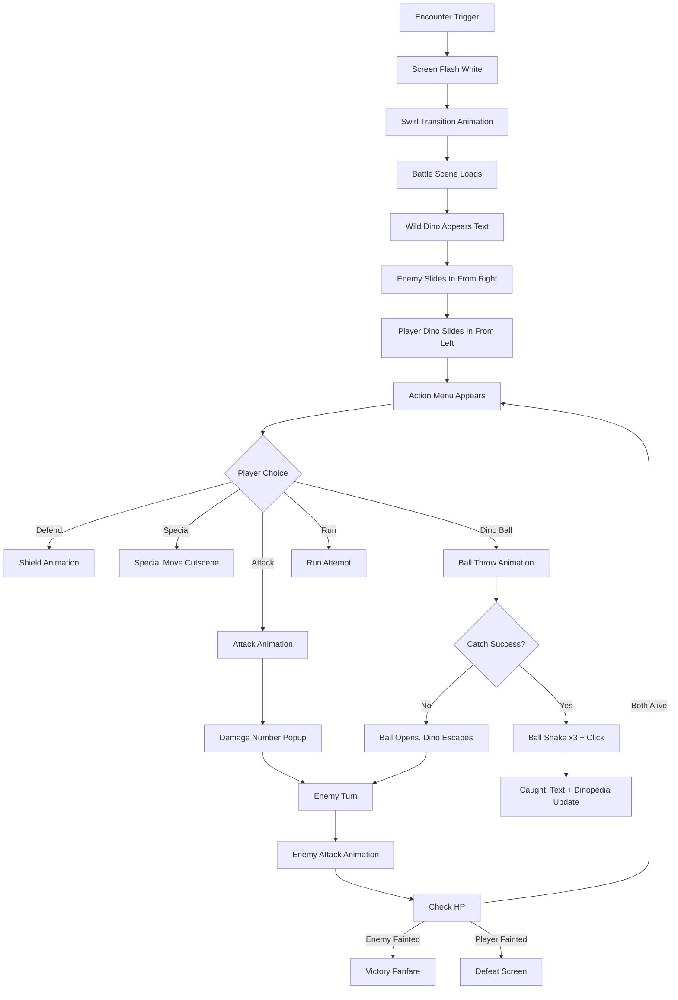

# Planetaurus — UX Direction: Pokémon DS Aesthetic

**Version:** 1.0  
**Author:** @UX (UI/UX Designer)  
**Style Reference:** Pokémon Diamond/Pearl/Platinum, HeartGold/SoulSilver (Nintendo DS, 2006–2010)  
**Platform:** React Native (Mobile, Portrait)

---

## 1. Screen Mapping: Planetaurus → Pokémon DS Equivalents

| Planetaurus Screen | Pokémon DS Equivalent | DS Screen Used | Notes |
|---|---|---|---|
| TitleScreen | Title Screen (D/P/Pt/HGSS) | Top | Legendary silhouette + logo + "Press Start" |
| NewGameScreen | Prof. Rowan/Oak intro | Both | NPC portrait top, dialogue bottom |
| StarterSelectScreen | Starter selection (Lake Verity / Prof. Lab) | Both | 3 Poké Balls on bottom, preview on top |
| WorldMapScreen | Overworld (Sinnoh/Johto) | Top=map, Bottom=menu | Tile-based movement, D-pad control |
| BattleScreen | Wild/Trainer Battle | Top=battle scene, Bottom=actions | HP bars top, action menu bottom |
| TeamScreen | Pokémon Party | Bottom (full) | 6-slot grid, drag to reorder |
| DinopediaScreen | Pokédex | Both | List on bottom, detail on top |
| InventoryScreen | Bag | Bottom (full) | Category tabs + item list |
| DinoLabScreen | — (unique to Planetaurus) | Both | Gene selection bottom, preview top |
| TrainingScreen | — (inspired by Pokéathlon/Contests) | Both | Mini-game area top, controls bottom |
| PlayWithDinoScreen | Pokémon Amie / Walking Pokémon | Top=dino, Bottom=actions | Touch interactions |
| MultiplayerLobbyScreen | Union Room / Wi-Fi Club | Bottom | Room list + create/join |
| RoomScreen | Union Room (in-room) | Top=map, Bottom=chat/actions | Shared map view |
| PvPBattleRequestModal | Battle request popup | Bottom overlay | Accept/Reject buttons |
| SettingsScreen | Options menu | Bottom | Simple list |

---

## 2. Dual-Screen Concept Adapted to Mobile Portrait

The Nintendo DS had two 256×192 screens stacked vertically. On mobile portrait, we replicate this with a **60/40 split** or **contextual panels**.

### 2.1 Layout Pattern: "DS Split"

```
┌─────────────────────────┐
│                         │
│      TOP PANEL          │  ← 55-60% of screen
│   (Visual / Display)    │  ← Shows scene, sprites, map
│                         │
│                         │
├─────────────────────────┤
│                         │
│     BOTTOM PANEL        │  ← 40-45% of screen
│   (Interactive / HUD)   │  ← Buttons, menus, D-pad
│                         │
└─────────────────────────┘
```

### 2.2 Layout Variants by Screen

#### World Map Layout
```
┌─────────────────────────┐
│  ┌───────────────────┐  │
│  │                   │  │
│  │   TILE MAP VIEW   │  │  ← Scrolling tile map
│  │   (Player center) │  │     Camera follows player
│  │                   │  │
│  └───────────────────┘  │
│  ┌─────┐ ┌───────────┐  │
│  │MINI │ │  QUICK    │  │  ← Minimap + party icons
│  │MAP  │ │  MENU BAR │  │
│  └─────┘ └───────────┘  │
│                         │
│    ┌───┐                │
│    │ ▲ │                │
│  ┌─┼───┼─┐  [A] [B]   │  ← Virtual D-pad + action buttons
│  │◄│   │►│             │
│  └─┼───┼─┘  [START]   │
│    │ ▼ │                │
│    └───┘                │
└─────────────────────────┘
```

#### Battle Layout
```
┌─────────────────────────┐
│  ┌───────────────────┐  │
│  │ [Enemy Name  Lv15]│  │  ← Enemy HP bar (top-right)
│  │ [████████░░] HP   │  │
│  │                   │  │
│  │    ╭───╮          │  │  ← Enemy sprite (back-center)
│  │    │ 🦕 │          │  │
│  │    ╰───╯          │  │
│  │          ╭───╮    │  │  ← Player sprite (front-right)
│  │          │ 🦖 │    │  │
│  │          ╰───╯    │  │
│  │ [My Dino    Lv12] │  │  ← Player HP/SP bar (bottom-left)
│  │ [████████░░] HP   │  │
│  │ [██████░░░░] SP   │  │
│  └───────────────────┘  │
├─────────────────────────┤
│                         │
│  ┌──────┐ ┌──────┐     │  ← 2x2 action grid
│  │ATTACK│ │DEFEND│     │     (Pokémon Fight/Bag/Run/Pokémon)
│  └──────┘ └──────┘     │
│  ┌──────┐ ┌──────┐     │
│  │SPECIA│ │ ITEM │     │
│  └──────┘ └──────┘     │
│  ┌──────┐ ┌──────┐     │
│  │D.BALL│ │ RUN  │     │
│  └──────┘ └──────┘     │
│                         │
└─────────────────────────┘
```

#### Dinopedia Layout
```
┌─────────────────────────┐
│  ┌───────────────────┐  │
│  │                   │  │
│  │   DINO PORTRAIT   │  │  ← Full sprite or silhouette
│  │                   │  │
│  │  Name: Rexlet     │  │
│  │  Type: Power      │  │
│  │  Height: 1.8m     │  │
│  └───────────────────┘  │
├─────────────────────────┤
│  ┌───────────────────┐  │
│  │ #001 Raptiny  ✓   │  │  ← Scrollable list
│  │ #002 Tricub   ✓   │  │     ✓ = caught
│  │ #003 Rexlet   ✓   │  │     ░ = silhouette
│  │ #004 ░░░░░░░  ?   │  │
│  │ #005 ░░░░░░░  ?   │  │
│  └───────────────────┘  │
│  [◄ PREV]    [NEXT ►]  │
└─────────────────────────┘
```

#### Starter Select Layout
```
┌─────────────────────────┐
│  ┌───────────────────┐  │
│  │                   │  │
│  │  SELECTED DINO    │  │  ← Large preview sprite
│  │  PREVIEW + STATS  │  │     with name + type + stats
│  │                   │  │
│  │  "Raptiny"       │  │
│  │  Speed Attacker   │  │
│  └───────────────────┘  │
├─────────────────────────┤
│                         │
│  "Choose your partner!" │  ← Professor dialogue
│                         │
│  ┌────┐ ┌────┐ ┌────┐  │  ← 3 Dino Ball sprites
│  │ ⚪ │ │ ⚪ │ │ ⚪ │  │     Tap to preview
│  │Rapt│ │Tric│ │Rexl│  │     Hold to select
│  └────┘ └────┘ └────┘  │
│                         │
│     [ CHOOSE! ]         │  ← Confirm button
└─────────────────────────┘
```

---

## 3. Interaction Patterns

### 3.1 Menu Navigation (Pokémon DS Style)

**Pattern:** Cursor-based menu with pixel-art selection indicator

```
┌─────────────────────┐
│  ► DINOSAURS        │  ← Arrow cursor moves with tap/swipe
│    DINOPEDIA        │
│    BAG              │
│    DINO LAB         │
│    SAVE             │
│    SETTINGS         │
│              [CLOSE]│
└─────────────────────┘
```

- **Open menu:** Tap hamburger icon or swipe right from edge
- **Navigate:** Tap item directly OR swipe up/down to move cursor
- **Select:** Tap highlighted item
- **Back:** Tap [B] button or swipe left
- **Sound:** Menu cursor SFX on every move, confirm SFX on select

### 3.2 Battle Flow



### 3.3 Encounter Transition

Inspired by Pokémon D/P/Pt encounter animation:

1. **Screen freezes** (50ms)
2. **Flash to white** (3 rapid flashes, 100ms each)
3. **Diagonal swirl wipe** (black triangles close in from corners, 400ms)
4. **Battle scene fades in** from black (300ms)
5. **Total transition time:** ~1.2 seconds

Implementation note for @FE: Use `react-native-reanimated` for the swirl/wipe. Pre-render the transition as a sprite sheet animation for performance.

### 3.4 Text Box / Dialogue Pattern

```
┌─────────────────────────────────────┐
│ Wild Rexlet appeared!               │
│ ▼                                   │  ← Blinking triangle = "tap to continue"
└─────────────────────────────────────┘
```

- Text appears **character by character** (typewriter effect, ~30ms per char)
- Tap anywhere to **instant-complete** current text
- Tap again to **advance** to next message
- Sound: soft "tick tick tick" during typewriter

### 3.5 D-Pad / Movement Controls

```
        ┌─────┐
        │  ▲  │
   ┌────┼─────┼────┐
   │ ◄  │     │ ►  │
   └────┼─────┼────┘
        │  ▼  │
        └─────┘
```

- **Position:** Bottom-left of screen (thumb-friendly)
- **Size:** 120×120dp minimum touch area
- **Behavior:** Hold direction = continuous movement (tile-by-tile, 200ms per tile)
- **Visual:** Semi-transparent pixel-art D-pad overlay
- **Action buttons (A/B):** Bottom-right, 56dp diameter each

### 3.6 Touch Patterns Summary

| Action | Gesture | Context |
|---|---|---|
| Move | Hold D-pad direction | World map |
| Interact/Confirm | Tap A button | Everywhere |
| Cancel/Back | Tap B button | Menus |
| Open menu | Tap START or hamburger | World map |
| Select battle action | Tap action button | Battle |
| Throw Dino Ball | Tap + swipe up (optional flair) | Battle |
| Pet dinosaur | Swipe on dino sprite | Play screen |
| Feed dinosaur | Drag food to dino | Play screen |
| Scroll list | Swipe up/down | Dinopedia, Inventory |

---

## 4. Visual Style Guide

### 4.1 Color Palette (DS Pokémon Inspired)

| Element | Color | Hex |
|---|---|---|
| UI Panel Background | Dark blue-gray | `#2C3E50` |
| UI Panel Border | Light gold | `#F4D03F` |
| Text Primary | White | `#FFFFFF` |
| Text Secondary | Light gray | `#BDC3C7` |
| HP Bar (Full) | Green | `#27AE60` |
| HP Bar (Mid) | Yellow | `#F39C12` |
| HP Bar (Low) | Red | `#E74C3C` |
| SP Bar | Blue-purple | `#8E44AD` |
| Menu Cursor | White arrow | `#FFFFFF` |
| Battle BG (Grass) | Warm green | `#6B8E23` |
| Dialogue Box | Dark navy | `#1B2631` |
| Dialogue Border | White/silver | `#ECF0F1` |

### 4.2 Typography

- **Primary font:** Pixel bitmap font, 8×8 or 16×16 grid
- **Dialogue text:** 16px equivalent, uppercase for names
- **Menu text:** 14px equivalent
- **Damage numbers:** Bold, 24px, with pop-up animation
- **Recommended fonts:**
  - "Press Start 2P" (Google Fonts, OFL license, free commercial use)
  - "Public Pixel" by GGBotNet (100% free)
  - "Pixeloid" by GGBotNet (100% free)

### 4.3 Animation Timing (DS Feel)

| Animation | Duration | Easing |
|---|---|---|
| Menu open | 150ms | ease-out |
| Menu cursor move | 80ms | linear |
| Text typewriter | 30ms/char | linear |
| Battle transition | 1200ms | custom |
| Attack animation | 400ms | ease-in-out |
| HP bar drain | 600ms | linear |
| Dino Ball shake | 300ms × 3 | ease-in-out |
| Screen fade | 300ms | linear |
| Sprite slide-in | 500ms | ease-out |

---

## 5. Recommended Free/Open-Source Assets

### 5.1 Map Tilesets

| Asset | URL | License | Size | Use Case |
|---|---|---|---|---|
| Kenney Roguelike/RPG Pack | https://kenney.nl/assets/roguelike-rpg-pack | CC0 | 16×16 | World map tiles, terrain, objects |
| Pipoya RPG Tileset 32x32 | https://pipoya.itch.io/pipoya-rpg-tileset-32x32 | Free (check page) | 32×32 | World map, buildings, nature |
| Anokolisa 16x16 RPG Tileset | https://anokolisa.itch.io/free-pixel-art-asset-pack-topdown-tileset-rpg-16x16-sprites | Free | 16×16 | Grass, paths, trees, water |
| Franuka RPG Asset Pack | https://franuka.itch.io/rpg-asset-pack | Free (check page) | 16/32/48 | Grass, hills, coastlines, houses |
| PixelHouse Retro Fantasy RPG Forest | https://pixelhouse.itch.io/retro-fantasy-rpg-monster-forest-tiles | Free | 16×16 | Forest/monster area tiles |
| MrPixelArtist 16x16 RPG Bundle | https://mrpixelartist.itch.io/pixelparadisebundle | Free | 16×16 | Cute RPG starter tiles |
| Open RPG Fantasy Tilesets (finalbossblues) | https://finalbossblues.itch.io/openrtp-tiles | CC0 | 32×32 | RPG Maker-style full tileset |

### 5.2 Monster/Dinosaur Sprites

| Asset | URL | License | Size | Use Case |
|---|---|---|---|---|
| OpenGameArt Pixel Dinosaurs | https://opengameart.org/content/pixel-dinosaurs | CC-BY 4.0 | Varies | Dinosaur overworld sprites |
| OpenGameArt Dinosaur Spritesheet Pack | https://opengameart.org/content/dinosaur-spritesheet-pack | Check page | Varies | Animated dino sprites |
| OpenGameArt Dinosaurs (6 types) | https://opengameart.org/content/dinosaurs | Check page | Varies | Ankylo, Ptero, Sauropod, T-Rex, Triceratops |
| OpenGameArt Free Dino Sprites | https://opengameart.org/content/free-dino-sprites | Check page | Varies | Cute dino character |
| Pixel Material Studio - 10 Free Monsters | https://pixelartmaterial.itch.io/pixel-monsters-free-10 | Check page | S/M/L | Battle monster sprites |
| Danaida Free Pixel Monsters 16x16 | https://danaida.itch.io/free-pixel-monsters-pack-16x16 | Free | 16×16 | Animated monster sprites |
| Free Monster Sprites Pixel Art | https://free-game-assets.itch.io/free-monster-sprites-pixel-art | Free | Varies | Monster battle sprites |
| OpenGameArt Pixel Art RPG Monster Sprites | https://opengameart.org/content/pixel-art-rpg-monster-sprites | OGA-BY 3.0 | Varies | Dragon, lizard, demon sprites |

### 5.3 Character Sprites (Player/NPC)

| Asset | URL | License | Size | Use Case |
|---|---|---|---|---|
| Pipoya Free RPG Character Sprites 32x32 | https://pipoya.itch.io/pipoya-free-rpg-character-sprites-32x32 | Free (no resell) | 32×32 | Player + NPC overworld sprites |
| James Mungall JRPG Character Sprites | https://jmungall.itch.io/jrpg-character-sprites | Free | 32×32 | 15 characters, stand + walk |
| Lexlom 32 Free Animated Characters | https://bittieblue.itch.io/32-character-pack-pixel-art-4-direction-idle-walking | Free | 32×32 | 32 characters, 4-dir walk |
| Snoblin Top-Down Prototype Character | https://snoblin.itch.io/pixel-rpg-free-npc | Free | Varies | NPC prototype |
| Brendon Bancer Top-Down Character Base | https://brendon-bancer.itch.io/top-down-character-base-8-directions-6-frames-32x32 | Free | 32×32 | 8-direction walk cycle |

### 5.4 UI Assets

| Asset | URL | License | Size | Use Case |
|---|---|---|---|---|
| Kenney UI Pack | https://kenney-assets.itch.io/ui-pack | CC0 | Varies | Buttons, panels, sliders |
| Kenney UI Pack RPG Extension | https://lpc.opengameart.org/content/ui-pack-rpg-extension | CC0 | Varies | RPG-specific UI elements |
| Kenney Pixel UI Pack (750 assets) | https://opengameart.org/content/pixel-ui-pack-750-assets | CC0 | Varies | Pixel-art panels, buttons |
| Veyroa Fantasy RPG UI (CC0) | https://veyroa.itch.io/fantasy-minimal-pixel-art-gui | CC0 | Varies | Minimal RPG UI panels |
| LetheDiana JRPG UI | https://ateliermayo.itch.io/jrpg-ui | Free (name your price) | Varies | Lifebar, dialogue box, menu |
| LoneGhostPxlArt Health Bars + UI | https://loneghostpxlart.itch.io/health-bars-and-ui | Free | Varies | HP/SP bars for battle |
| AscendancyArcade Health UI Pack | https://ascendancyarcadellc.itch.io/health-ui-pixel-pack | Free | Varies | Animated health bars |

### 5.5 Battle Backgrounds

| Asset | URL | License | Size | Use Case |
|---|---|---|---|---|
| GNDLF Battle/RPG Backgrounds | https://arexxuru.itch.io/battle-rpg-backgrounds | Check page | Varies | Forest, cave, volcano battle BGs |
| edermunizz Free Pixel Art Forest | https://edermunizz.itch.io/free-pixel-art-forest | Free | Varies | Forest parallax background |
| SlashDash Cave Background | https://slashdashgamesstudio.itch.io/cave-background-pixel-art | Free | Varies | Cave battle background |

### 5.6 Sound Effects & Music

| Asset | URL | License | Use Case |
|---|---|---|---|
| May Genko Basic Retro RPG SFX | https://maygenko.itch.io/basic-rpg-sfx-by-maygenko | Free | Menu, encounter, battle SFX |
| NSFRL Retro Combat Sound Effects | https://nsfrl.itch.io/retro-combat-sound-effects | Free | 170 combat effects (16-bit style) |
| dancramp 8-Bit Retro RPG Music (CC0) | https://dancramp.itch.io/8-bit-retro-rpg-music-asset-pack | CC0 | Background music loops |
| megrIm 8-Bit Fantasy RPG Music | https://megrim.itch.io/8-bit-fantasy-rpg-music-pack | Free | Combat, exploration, town tracks |
| Chris Kohler 8-Bit RPG Adventure | https://chriskohler.itch.io/8-bit-rpg-adventure | Free | Overworld, dungeon, battle music |
| SoundsByDane 8-Bit Sound Pack | https://soundsbydane.itch.io/8-bit-sound-pack | Free | Adventure/RPG sound effects |
| enprimer Free RPG Sound Effects | https://enprimer.itch.io/rpg-soundeffects-pack | Free | Attack, menu, expression SFX |

### 5.7 Fonts

| Font | URL | License | Use Case |
|---|---|---|---|
| Press Start 2P | https://fonts.google.com/specimen/Press+Start+2P | OFL (free commercial) | Primary game font |
| Public Pixel | https://www.fontspace.com/public-pixel-font-f72785 | 100% Free | Alternative pixel font |
| Pixeloid | https://www.fontspace.com/pixeloid-font-f69232 | 100% Free | UI text, readable at small sizes |

---

## 6. DS-Era Pokémon UX Patterns to Replicate

### 6.1 Key Visual Signatures

1. **Rounded rectangle panels** with 2px border and slight inner shadow
2. **Blue/dark gradient** dialogue boxes with white text
3. **HP bars** that are thin (4px height), with colored fill and dark outline
4. **Sprite pop-in** animations (slide from side, bounce settle)
5. **White flash** on damage taken
6. **Screen shake** on heavy attacks (2-3px, 100ms)
7. **Pixel-perfect rendering** — no anti-aliasing, nearest-neighbor scaling
8. **Consistent 4px grid** for all UI element spacing

### 6.2 Sound Design Signatures

- Menu cursor: short "pip" sound
- Menu confirm: "ding" (higher pitch)
- Menu cancel: "boop" (lower pitch)
- Encounter: rapid ascending notes → battle music
- Attack hit: sharp "crack" or "slash"
- Super effective: extra "zing" after hit
- Catch attempt: "whoosh" → "click click click" (ball shaking)
- Level up: ascending arpeggio fanfare
- Text advance: soft "tick"

### 6.3 Screen Transition Patterns

| Transition | From → To | Animation |
|---|---|---|
| Encounter | World → Battle | White flash × 3 → diagonal wipe to black → fade in battle |
| Battle end | Battle → World | Fade to black → fade in world |
| Menu open | World → Menu | Slide in from right (200ms) |
| Menu close | Menu → World | Slide out to right (150ms) |
| Map change | World → World | Fade to black → fade in new map |
| Dinopedia open | Menu → Dinopedia | Slide up from bottom |
| Starter select | Dialogue → Select | Cross-fade |

---

## 7. Implementation Notes for @FE

### 7.1 Rendering Strategy

- Use **nearest-neighbor** image scaling (`resizeMode: 'nearest'` or custom shader)
- Render tiles at **integer multiples** (2×, 3×, 4×) to avoid sub-pixel blur
- For 16×16 tiles on a 390px wide phone: render at 3× = 48px per tile → 8 tiles visible width
- For 32×32 tiles: render at 2× = 64px per tile → 6 tiles visible width

### 7.2 Sprite Sheet Handling

- Use sprite sheet PNGs with fixed frame dimensions
- Animate by offsetting `clipRect` or using `react-native-reanimated` shared values
- Pre-calculate frame positions in asset config (see GAME_DEVELOPMENT_DESIGN.md §15.9)

### 7.3 React Native Pixel Art Rendering

```
Image component props:
- resizeMode="cover" (for backgrounds)
- style={{ imageRendering: 'pixelated' }} (web)
- For RN: use react-native-fast-image with resize method "nearest"
  OR render via Skia canvas with FilterQuality.None
```

### 7.4 Performance Considerations

- Only render tiles within viewport + 1 tile buffer
- Use `FlatList` with `getItemLayout` for Dinopedia/Inventory lists
- Pre-load battle sprites during encounter transition animation
- Cache frequently used sprites in memory

---

## 8. Accessibility

| Requirement | Implementation |
|---|---|
| Touch targets | Minimum 48×48dp for all interactive elements |
| Color contrast | 4.5:1 minimum for text on panels |
| Text size | Support system font scaling (up to 1.5×) |
| D-pad size | Configurable in settings (S/M/L) |
| Haptic feedback | Vibrate on battle hits, catches, level-ups |
| Reduced motion | Option to disable screen shake and flash effects |
| Colorblind mode | HP bar uses pattern fill in addition to color |

---

## 9. Priority Asset Acquisition Order

For MVP, acquire assets in this order:

1. **Map tiles** (Kenney Roguelike/RPG Pack — CC0, immediate use)
2. **Player character sprite** (Pipoya 32x32 — free, 4-dir walk)
3. **UI panels + HP bars** (Kenney Pixel UI Pack — CC0)
4. **Monster/dino sprites** (OpenGameArt Pixel Dinosaurs + Danaida 16x16 pack)
5. **Battle backgrounds** (edermunizz forest + SlashDash cave)
6. **Sound effects** (May Genko RPG SFX + NSFRL combat)
7. **Music** (dancramp CC0 8-bit RPG pack)
8. **Font** (Press Start 2P from Google Fonts)

---

## 10. Asset License Summary

| License | Assets | Requirements |
|---|---|---|
| CC0 | Kenney packs, dancramp music, Veyroa UI | None — free to use |
| CC-BY 4.0 | OpenGameArt Pixel Dinosaurs | Credit author in ATTRIBUTION.md |
| OGA-BY 3.0 | OpenGameArt RPG Monster Sprites | Credit on OGA page |
| OFL | Press Start 2P font | Include license file |
| Free (no resell) | Pipoya sprites, various itch.io | Cannot resell assets standalone |
| Check page | Several itch.io assets | Verify before final release |

**Rule:** Always verify the license on the actual download page before including in production build. Add every asset to `ATTRIBUTION.md` regardless of license type.

---

## Appendix: Quick Reference Card

```
PLANETAURUS DS-STYLE QUICK REFERENCE
=====================================

Layout:     60% top (visual) / 40% bottom (interactive)
Tile size:  16×16 or 32×32, rendered at integer scale
Font:       Press Start 2P, 8px base
Colors:     Dark navy panels, gold borders, white text
Animation:  Snappy (80-400ms), no easing on pixel movement
Sound:      8-bit/16-bit chiptune style
Transition: White flash → diagonal wipe → fade in
Controls:   Virtual D-pad (left) + A/B buttons (right)
Menu:       Cursor-based, tap or swipe to navigate
Battle:     2×3 action grid, typewriter text, HP drain animation
```
